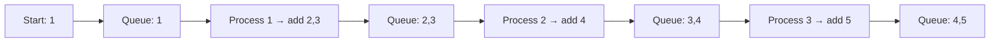

# Chapter 11: Graphs

Graphs model relationships between objects. This chapter covers graph representations, traversals (DFS, BFS), shortest path algorithms, minimum spanning trees, topological sorting, cycle detection, strongly connected components, network flow basics, and classic graph problems. Each section includes definitions, complexity, C++ implementations, and real‑life analogies.

## 1. Graph Representations

A graph G = (V, E) consists of vertices (nodes) and edges (connections). Edges can be directed or undirected, weighted or unweighted.

### 1.1 Adjacency Matrix

**What**: A V×V matrix where `matrix[u][v] = 1` (or weight) if edge exists from u to v.

- **Space**: O(V²). **Time for edge lookup**: O(1).  
- **When to use**: Dense graphs, or when O(1) edge existence is critical.

```java
vector<vector<int>> adjMat(V, vector<int>(V, 0));
adjMat[u][v] = 1;        // add edge u→v
if (adjMat[u][v]) {...} // check edge
```

### 1.2 Adjacency List

**What**: Array of V lists (or vectors). List at index u stores neighbours (and possibly weights).

- **Space**: O(V + E). **Time for edge lookup**: O(degree(u)).  
- **When to use**: Sparse graphs, most practical applications.

```java
vector<vector<int>> adjList(V);
adjList[u].push_back(v);            // unweighted
// weighted
vector<vector<pair<int,int>>> adjWeighted(V);
adjWeighted[u].push_back({v, w});
```

### 1.3 Edge List

**What**: A single list of all edges (u, v, weight). Used in algorithms like Kruskal.

```java
struct Edge { int u, v, w; };
vector<Edge> edges;
edges.push_back({u, v, w});
```

**Real‑life analogy**:  
- Adjacency matrix: A city‑to‑city road table (rows and columns).  
- Adjacency list: Each city has a list of direct flight destinations.  
- Edge list: A plain log of all flights.

## 2. Graph Traversals

### 2.1 Depth First Search (DFS)

**What**: Explores as far as possible along each branch before backtracking.

**Uses**: Cycle detection, topological sorting, connected components, solving puzzles.

**Recursive**:

```java
void dfs(int u, List<Boolean> visited, List<List<Integer>> adj) {
    visited.set(u, true);
    System.out.print(u + " ");
    for (int v : adj.get(u)) {
        if (!visited.get(v)) dfs(v, visited, adj);
    }
}
```

**Iterative (using stack)**:

```java
void dfsIterative(int start, List<List<Integer>> adj) {
    List<Boolean> visited = new ArrayList<>(Collections.nCopies(adj.size(), false));
    Deque<Integer> st = new ArrayDeque<>();
    st.push(start);
    while (!st.isEmpty()) {
        int u = st.pop();
        if (visited.get(u)) continue;
        visited.set(u, true);
        System.out.print(u + " ");
        for (int v : adj.get(u)) {
            if (!visited.get(v)) st.push(v);
        }
    }
}
```

### 2.2 Breadth First Search (BFS)

**What**: Explores level by level, using a queue.

**Uses**: Shortest path in unweighted graphs, word ladder, web crawling.

```java
void bfs(int start, List<List<Integer>> adj) {
    List<Boolean> visited = new ArrayList<>(Collections.nCopies(adj.size(), false));
    Queue<Integer> q = new LinkedList<>();
    visited.set(start, true);
    q.add(start);
    while (!q.isEmpty()) {
        int u = q.poll();
        System.out.print(u + " ");
        for (int v : adj.get(u)) {
            if (!visited.get(v)) {
                visited.set(v, true);
                q.add(v);
            }
        }
    }
}
```



**Real‑life analogy**: BFS is like ripples in water after throwing a stone; DFS is like exploring a maze by always turning left.

## 3. Shortest Path Algorithms

### 3.1 Unweighted Graph: BFS

BFS finds shortest path (minimum number of edges) from source to all vertices.

```java
List<Integer> bfsShortestPath(int start, List<List<Integer>> adj) {
    int V = adj.size();
    List<Integer> dist = new ArrayList<>(Collections.nCopies(V, -1));
    Queue<Integer> q = new LinkedList<>();
    dist.set(start, 0);
    q.add(start);
    while (!q.isEmpty()) {
        int u = q.poll();
        for (int v : adj.get(u)) {
            if (dist.get(v) == -1) {
                dist.set(v, dist.get(u) + 1);
                q.add(v);
            }
        }
    }
    return dist;
}
```

### 3.2 Weighted Graph (Non‑negative): Dijkstra’s Algorithm

**What**: Finds shortest paths from source using a min‑heap (priority queue). Greedy.

**Time**: O((V+E) log V) with binary heap.

```java
vector<int> dijkstra(int src, vector<vector<pair<int,int>>>& adj) {
    int V = adj.size();
    vector<int> dist(V, INT_MAX);
    dist[src] = 0;
    using P = pair<int,int>; // (distance, node)
    priority_queue<P, vector<P>, greater<P>> pq;
    pq.push({0, src});
    while (!pq.empty()) {
        auto [d, u] = pq.top(); pq.pop();
        if (d > dist[u]) continue;
        for (auto [v, w] : adj[u]) {
            if (dist[v] > dist[u] + w) {
                dist[v] = dist[u] + w;
                pq.push({dist[v], v});
            }
        }
    }
    return dist;
}
```

**Real‑life analogy**: GPS navigation with non‑negative road distances – always pick the closest unvisited city.

### 3.3 Weighted Graph (Negative Edges): Bellman‑Ford

**What**: Relaxes all edges V‑1 times. Detects negative cycles.

**Time**: O(V*E).

```java
vector<int> bellmanFord(int src, int V, vector<tuple<int,int,int>>& edges) {
    vector<int> dist(V, INT_MAX);
    dist[src] = 0;
    for (int i = 0; i < V-1; ++i) {
        for (auto [u, v, w] : edges) {
            if (dist[u] != INT_MAX && dist[v] > dist[u] + w)
                dist[v] = dist[u] + w;
        }
    }
    // Check negative cycles
    for (auto [u, v, w] : edges) {
        if (dist[u] != INT_MAX && dist[v] > dist[u] + w)
            return {}; // negative cycle
    }
    return dist;
}
```

### 3.4 All‑Pairs Shortest Paths: Floyd‑Warshall

**What**: Dynamic programming – consider each vertex as intermediate.

**Time**: O(V³). **Space**: O(V²).

```java
vector<vector<int>> floydWarshall(vector<vector<int>>& graph) {
    int V = graph.size();
    vector<vector<int>> dist = graph;
    for (int k = 0; k < V; ++k)
        for (int i = 0; i < V; ++i)
            for (int j = 0; j < V; ++j)
                if (dist[i][k] != INT_MAX && dist[k][j] != INT_MAX)
                    dist[i][j] = min(dist[i][j], dist[i][k] + dist[k][j]);
    return dist;
}
```

## 4. Minimum Spanning Tree (MST)

An MST connects all vertices with minimal total edge weight. No cycles.

### 4.1 Prim’s Algorithm

Grows a tree from a start vertex, always adding the cheapest edge from the tree to outside.

**Time**: O((V+E) log V) with min‑heap.

```java
int primMST(vector<vector<pair<int,int>>>& adj) {
    int V = adj.size(), total = 0;
    vector<bool> inMST(V, false);
    using P = pair<int,int>; // (weight, vertex)
    priority_queue<P, vector<P>, greater<P>> pq;
    pq.push({0, 0}); // start from vertex 0
    while (!pq.empty()) {
        auto [w, u] = pq.top(); pq.pop();
        if (inMST[u]) continue;
        inMST[u] = true;
        total += w;
        for (auto [v, weight] : adj[u])
            if (!inMST[v]) pq.push({weight, v});
    }
    return total;
}
```

**Real‑life analogy**: Laying fibre optic cable connecting all towns with minimum cost – always extend from current network to the cheapest unconnected town.

### 4.2 Kruskal’s Algorithm

Sorts edges by weight, adds edges that do not create cycles (using Union‑Find).

**Time**: O(E log E) (sorting) + O(E α(V)).

```java
struct DSU {
    vector<int> parent, rank;
    DSU(int n) {
        parent.resize(n); rank.resize(n,0);
        for(int i=0;i<n;++i) parent[i]=i;
    }
    int find(int x) { return parent[x]==x ? x : parent[x]=find(parent[x]); }
    bool unite(int x, int y) {
        int rx=find(x), ry=find(y);
        if(rx==ry) return false;
        if(rank[rx]<rank[ry]) parent[rx]=ry;
        else if(rank[rx]>rank[ry]) parent[ry]=rx;
        else { parent[ry]=rx; rank[rx]++; }
        return true;
    }
};

int kruskalMST(vector<tuple<int,int,int>>& edges, int V) {
    sort(edges.begin(), edges.end()); // by weight
    DSU dsu(V);
    int total = 0, edgesUsed = 0;
    for (auto [w, u, v] : edges) {
        if (dsu.unite(u, v)) {
            total += w;
            edgesUsed++;
            if (edgesUsed == V-1) break;
        }
    }
    return total;
}
```

## 5. Topological Sorting

**Definition**: Linear ordering of vertices in a DAG (directed acyclic graph) such that for every edge (u→v), u appears before v.

**Real‑life analogy**: Course prerequisites – you must take prerequisites before advanced courses.

### 5.1 Kahn’s Algorithm (BFS)

Compute indegree of each node. Push zero indegree nodes to queue, remove their outgoing edges, repeat.

```java
vector<int> topologicalSortKahn(vector<vector<int>>& adj) {
    int V = adj.size();
    vector<int> indeg(V, 0), result;
    for (int u=0; u<V; ++u)
        for (int v : adj[u]) indeg[v]++;
    queue<int> q;
    for (int i=0; i<V; ++i) if (indeg[i]==0) q.push(i);
    while (!q.empty()) {
        int u = q.front(); q.pop();
        result.push_back(u);
        for (int v : adj[u])
            if (--indeg[v] == 0) q.push(v);
    }
    return result.size() == V ? result : vector<int>{}; // cycle if size < V
}
```

### 5.2 DFS‑based

Perform DFS; push node to result after processing all neighbours (postorder). Reverse the result.

```java
void dfsTopo(int u, vector<bool>& visited, stack<int>& st, vector<vector<int>>& adj) {
    visited[u] = true;
    for (int v : adj[u])
        if (!visited[v]) dfsTopo(v, visited, st, adj);
    st.push(u);
}
vector<int> topologicalSortDFS(vector<vector<int>>& adj) {
    int V = adj.size();
    vector<bool> visited(V, false);
    stack<int> st;
    for (int i=0; i<V; ++i)
        if (!visited[i]) dfsTopo(i, visited, st, adj);
    vector<int> result;
    while (!st.empty()) { result.push_back(st.top()); st.pop(); }
    return result;
}
```

## 6. Cycle Detection

### 6.1 Undirected Graph

**Using DFS**: If a neighbour is already visited and is not the parent, cycle exists.

```java
bool hasCycleUndirectedDFS(int u, int parent, vector<bool>& visited, vector<vector<int>>& adj) {
    visited[u] = true;
    for (int v : adj[u]) {
        if (!visited[v]) {
            if (hasCycleUndirectedDFS(v, u, visited, adj)) return true;
        } else if (v != parent) return true;
    }
    return false;
}
```

**Using Union‑Find**: If two vertices of an edge already belong to the same set, cycle exists.

### 6.2 Directed Graph

**Using DFS with recursion stack**: Maintain a separate `inStack` array.

```java
bool hasCycleDirectedDFS(int u, vector<bool>& visited, vector<bool>& inStack, vector<vector<int>>& adj) {
    visited[u] = true;
    inStack[u] = true;
    for (int v : adj[u]) {
        if (!visited[v]) {
            if (hasCycleDirectedDFS(v, visited, inStack, adj)) return true;
        } else if (inStack[v]) return true;
    }
    inStack[u] = false;
    return false;
}
```

## 7. Strongly Connected Components (SCC)

A strongly connected component is a maximal set of vertices where every pair has a path in both directions.

### 7.1 Kosaraju’s Algorithm

1. Run DFS on original graph to get finishing order (postorder).  
2. Reverse the graph.  
3. Run DFS on reversed graph in order of decreasing finishing times – each DFS tree gives an SCC.

```java
void dfsOrder(int u, vector<bool>& visited, stack<int>& st, vector<vector<int>>& adj) {
    visited[u] = true;
    for (int v : adj[u]) if (!visited[v]) dfsOrder(v, visited, st, adj);
    st.push(u);
}
void dfsSCC(int u, vector<bool>& visited, vector<int>& comp, vector<vector<int>>& revAdj) {
    visited[u] = true;
    comp.push_back(u);
    for (int v : revAdj[u]) if (!visited[v]) dfsSCC(v, visited, comp, revAdj);
}
vector<vector<int>> kosaraju(vector<vector<int>>& adj) {
    int V = adj.size();
    vector<bool> visited(V, false);
    stack<int> st;
    for (int i=0; i<V; ++i) if (!visited[i]) dfsOrder(i, visited, st, adj);
    // build reverse graph
    vector<vector<int>> revAdj(V);
    for (int u=0; u<V; ++u) for (int v : adj[u]) revAdj[v].push_back(u);
    fill(visited.begin(), visited.end(), false);
    vector<vector<int>> sccs;
    while (!st.empty()) {
        int u = st.top(); st.pop();
        if (!visited[u]) {
            vector<int> comp;
            dfsSCC(u, visited, comp, revAdj);
            sccs.push_back(comp);
        }
    }
    return sccs;
}
```

### 7.2 Tarjan’s Algorithm

Single DFS with low‑link values. More efficient (one pass).

## 8. Network Flow (Basic)

**Max flow / min cut**: Find maximum flow from source to sink in a weighted directed graph.

### Ford‑Fulkerson (Edmonds‑Karp)

Use BFS to find augmenting paths (Edmonds‑Karp). Time O(V * E²).

```java
int bfsFlow(int s, int t, vector<int>& parent, vector<vector<int>>& cap) {
    fill(parent.begin(), parent.end(), -1);
    parent[s] = s;
    queue<pair<int,int>> q;
    q.push({s, INT_MAX});
    while (!q.empty()) {
        auto [u, flow] = q.front(); q.pop();
        for (int v = 0; v < cap.size(); ++v) {
            if (parent[v] == -1 && cap[u][v] > 0) {
                parent[v] = u;
                int newFlow = min(flow, cap[u][v]);
                if (v == t) return newFlow;
                q.push({v, newFlow});
            }
        }
    }
    return 0;
}
int maxFlow(int s, int t, vector<vector<int>>& cap) {
    int flow = 0, newFlow;
    vector<int> parent(cap.size());
    while ((newFlow = bfsFlow(s, t, parent, cap)) > 0) {
        flow += newFlow;
        int v = t;
        while (v != s) {
            int u = parent[v];
            cap[u][v] -= newFlow;
            cap[v][u] += newFlow;
            v = u;
        }
    }
    return flow;
}
```

**Real‑life analogy**: Water flowing through pipes; maximum flow is the total water that can be sent from source to sink.

## 9. Important Graph Problems

### 9.1 Clone a Graph

**Problem**: Deep copy an undirected graph with arbitrary structure.

**Approach**: BFS/DFS using a hash map (original → copy node).

```java
Node* cloneGraph(Node* node) {
    if (!node) return nullptr;
    unordered_map<Node*, Node*> m;
    queue<Node*> q;
    m[node] = new Node(node->val);
    q.push(node);
    while (!q.empty()) {
        Node* cur = q.front(); q.pop();
        for (Node* nei : cur->neighbors) {
            if (m.find(nei) == m.end()) {
                m[nei] = new Node(nei->val);
                q.push(nei);
            }
            m[cur]->neighbors.push_back(m[nei]);
        }
    }
    return m[node];
}
```

### 9.2 Word Ladder

**Problem**: Shortest transformation sequence (word → word) changing one letter at a time, using a dictionary.

**Approach**: BFS from startWord.

```java
int ladderLength(string beginWord, string endWord, vector<string>& wordList) {
    unordered_set<string> dict(wordList.begin(), wordList.end());
    if (dict.find(endWord) == dict.end()) return 0;
    queue<pair<string,int>> q;
    q.push({beginWord, 1});
    while (!q.empty()) {
        auto [cur, len] = q.front(); q.pop();
        for (int i=0; i<cur.size(); ++i) {
            string temp = cur;
            for (char c='a'; c<='z'; ++c) {
                temp[i] = c;
                if (temp == cur) continue;
                if (temp == endWord) return len+1;
                if (dict.find(temp) != dict.end()) {
                    q.push({temp, len+1});
                    dict.erase(temp);
                }
            }
        }
    }
    return 0;
}
```

### 9.3 Course Schedule (Topological Sort)

**Problem**: Check if all courses can be finished given prerequisites.

**Approach**: Detect cycle in directed graph (DFS or Kahn). If DAG, possible.

```java
bool canFinish(int numCourses, vector<vector<int>>& prerequisites) {
    vector<vector<int>> adj(numCourses);
    vector<int> indeg(numCourses, 0);
    for (auto& p : prerequisites) {
        adj[p[1]].push_back(p[0]);
        indeg[p[0]]++;
    }
    queue<int> q;
    for (int i=0; i<numCourses; ++i) if (indeg[i]==0) q.push(i);
    int processed = 0;
    while (!q.empty()) {
        int u = q.front(); q.pop();
        processed++;
        for (int v : adj[u])
            if (--indeg[v] == 0) q.push(v);
    }
    return processed == numCourses;
}
```

### 9.4 Number of Islands

**Problem**: Count connected components of '1's in a binary grid.

**Approach**: DFS/BFS to mark visited.

```java
void dfsIsland(vector<vector<char>>& grid, int i, int j) {
    if (i<0 || i>=grid.size() || j<0 || j>=grid[0].size() || grid[i][j]!='1') return;
    grid[i][j] = '0';
    dfsIsland(grid, i+1, j); dfsIsland(grid, i-1, j);
    dfsIsland(grid, i, j+1); dfsIsland(grid, i, j-1);
}
int numIslands(vector<vector<char>>& grid) {
    int count = 0;
    for (int i=0; i<grid.size(); ++i)
        for (int j=0; j<grid[0].size(); ++j)
            if (grid[i][j] == '1') { dfsIsland(grid, i, j); count++; }
    return count;
}
```

### 9.5 Bipartite Graph Checking

**Problem**: Check if graph is bipartite (2‑colorable).

**Approach**: BFS / DFS assigning colours.

```java
bool isBipartite(vector<vector<int>>& graph) {
    int V = graph.size();
    vector<int> color(V, -1);
    for (int i=0; i<V; ++i) {
        if (color[i] != -1) continue;
        queue<int> q;
        q.push(i); color[i] = 0;
        while (!q.empty()) {
            int u = q.front(); q.pop();
            for (int v : graph[u]) {
                if (color[v] == -1) {
                    color[v] = color[u] ^ 1;
                    q.push(v);
                } else if (color[v] == color[u]) return false;
            }
        }
    }
    return true;
}
```

## 10. Summary Table

| Algorithm | Graph Type | Time Complexity | Key Data Structure |
|-----------|------------|----------------|---------------------|
| DFS/BFS | Any | O(V+E) | Stack / Queue |
| Dijkstra | Weighted (non‑negative) | O((V+E) log V) | Min‑heap |
| Bellman‑Ford | Weighted (negative allowed) | O(V*E) | Edge list |
| Floyd‑Warshall | Weighted (all‑pairs) | O(V³) | 2D array |
| Prim (MST) | Weighted undirected | O((V+E) log V) | Min‑heap |
| Kruskal (MST) | Weighted undirected | O(E log E) | DSU + sorting |
| Topological Sort | DAG | O(V+E) | Queue (Kahn) / Stack (DFS) |
| Kosaraju (SCC) | Directed | O(V+E) | DFS on reverse graph |
| Edmonds‑Karp | Weighted directed | O(V*E²) | BFS + residual graph |

The next chapter will cover advanced topics: dynamic programming (memoisation, tabulation, classic DP problems).
