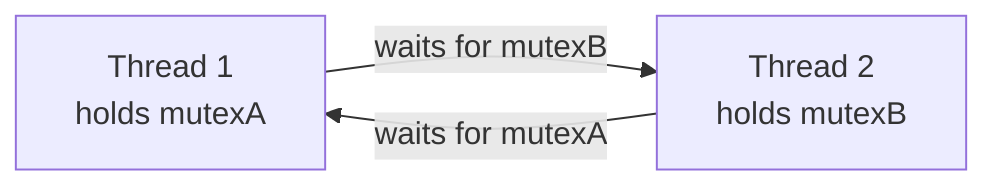
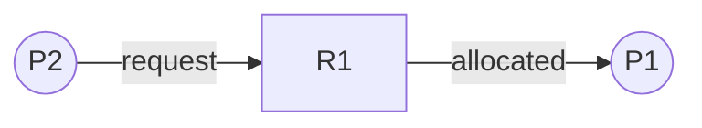
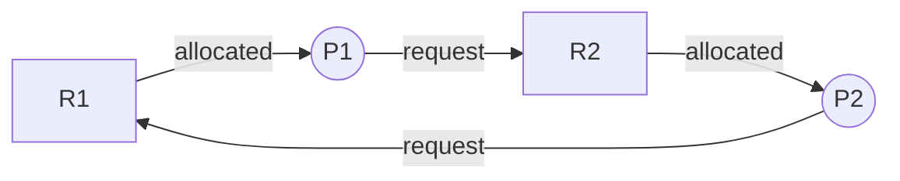
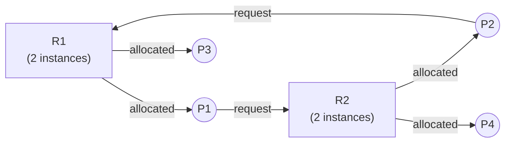
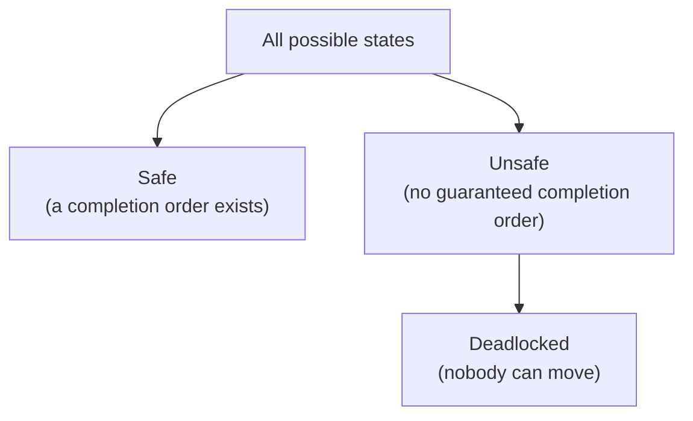
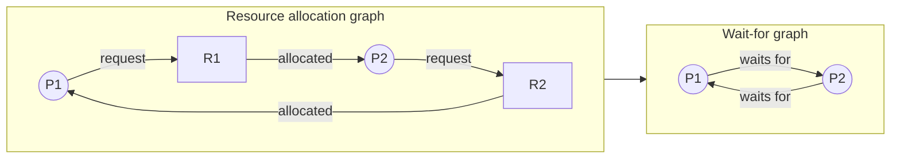
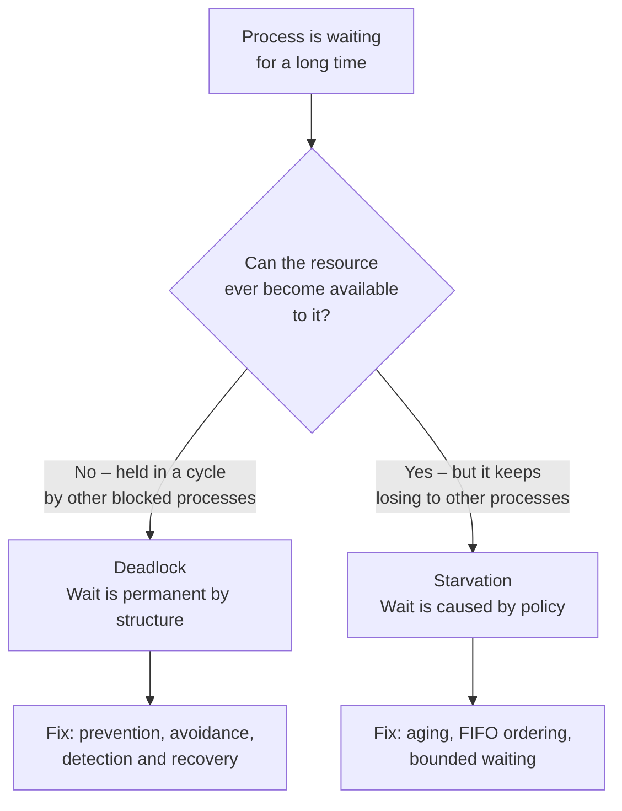

# Chapter 5: Deadlocks

In a multiprogramming environment, processes compete for resources. Sometimes, a set of processes gets stuck forever, each waiting for a resource held by another in the set. This situation is a **deadlock**. This chapter explains how deadlocks occur, how to represent them, and the classic strategies to prevent, avoid, detect, or ignore them.

---

## Deadlock Characterization

A deadlock occurs when two or more processes are each waiting indefinitely for an event (usually resource release) that can only be caused by another waiting process. For a deadlock to happen, **four necessary conditions** must hold simultaneously.

### The Four Conditions

| Condition | Description |
|-----------|-------------|
| **Mutual exclusion** | At least one resource must be held in non‑shareable mode. Only one process can use the resource at a time. |
| **Hold and wait** | A process holding at least one resource is waiting to acquire additional resources held by other processes. |
| **No preemption** | Resources cannot be forcibly taken away from a process. Only the holding process can release them voluntarily. |
| **Circular wait** | There exists a set {P₀, P₁, …, Pₙ} such that P₀ waits for a resource held by P₁, P₁ waits for P₂, …, Pₙ waits for P₀. |

All four must hold **at the same time**. Break any single one and deadlock becomes impossible – this is exactly what the prevention strategies later in the chapter do.

**Real‑life analogy**: Two cars meet at a four‑way stop intersection.
- **Mutual exclusion** – Only one car can occupy the intersection at a time.
- **Hold and wait** – Each car holds its position (already in the intersection or at the line) and waits for the other to move.
- **No preemption** – No traffic officer can push a car aside.
- **Circular wait** – Car A waits for Car B to clear the intersection; Car B waits for Car A to clear. Both block.

**The same thing in code** – the classic two‑lock deadlock. Each thread grabs one mutex, then reaches for the other:

```c
// Thread 1                     // Thread 2
lock(&mutexA);                  lock(&mutexB);
lock(&mutexB);   // blocks      lock(&mutexA);   // blocks
// critical section             // critical section
unlock(&mutexB);                unlock(&mutexA);
unlock(&mutexA);                unlock(&mutexB);
```

If Thread 1 acquires `mutexA` and Thread 2 acquires `mutexB` before either reaches its second `lock()`, both block forever. Note that this program may run correctly thousands of times – deadlock only appears when the interleaving is just wrong, which is what makes these bugs so hard to reproduce.



That closed loop of arrows is the circular wait condition. Every deadlock, no matter how many processes are involved, reduces to a cycle like this one.

---

## Resource Allocation Graph

A **Resource Allocation Graph (RAG)** is a directed graph that visually represents the state of resource allocation. It helps detect whether deadlock exists.

- **Vertices**: Two types
  - Process vertices (circles): P₁, P₂, …, Pₙ
  - Resource vertices (squares): R₁, R₂, …, Rₘ (each may have one or more identical instances)
- **Edges**:
  - **Request edge** (Pᵢ → Rⱼ): Process Pᵢ has requested an instance of Rⱼ and is waiting.
  - **Assignment edge** (Rⱼ → Pᵢ): An instance of Rⱼ has been allocated to Pᵢ.

The direction of the arrow is the whole trick: **towards** a resource means “I am asking for this”, **away from** a resource means “I already have this”.

**Case 1 – No cycle, no deadlock**. P1 holds R1 and wants nothing else; P2 waits for R1. As soon as P1 finishes, R1 frees up and P2 proceeds.



**Case 2 – Cycle with single‑instance resources → deadlock**. P1 holds R1 and requests R2; P2 holds R2 and requests R1. Neither can move.



**Case 3 – Cycle with multiple instances → not necessarily deadlock**. Here R1 and R2 each have **two** instances, and all four are allocated. There is a cycle P1 → R2 → P2 → R1 → P1, yet no deadlock: the spare instances are held by P3 and P4, neither of which is waiting for anything. When P4 finishes it releases its instance of R2, P1 takes it, and the cycle unravels.



**Rules for reading a RAG**:

| Graph shape | Conclusion |
|-------------|------------|
| No cycle | **No deadlock**, guaranteed. |
| Cycle, all resources have a single instance | **Deadlock**, guaranteed. |
| Cycle, some resource has multiple instances | **Possible** deadlock – must check further (run the detection algorithm). |

In short: a cycle is a *necessary* condition for deadlock, but only *sufficient* when every resource in the cycle has exactly one instance.

**Real‑life analogy**: A whiteboard showing who holds which resource (e.g., printer, scanner) and who is waiting for what. An arrow from a person to a resource means “I want that”; an arrow from resource to person means “this person has it”. If you see a circle of arrows, people may be deadlocked.

---

## Methods for Handling Deadlocks

Operating systems use one of four approaches to deal with deadlocks, ranging from idealistic to pragmatic.

| Approach | Philosophy | Overhead | Practicality |
|----------|------------|----------|--------------|
| **Prevention** | Ensure at least one condition never holds | High | Rarely used |
| **Avoidance** | Allocate resources carefully using extra info | Medium | Feasible for fixed resources |
| **Detection & Recovery** | Allow deadlock, then break it | Medium | Common in databases |
| **Ignorance (Ostrich)** | Assume deadlocks won’t happen | None | Most general‑purpose OSes (Windows, Linux) |

---

### 1. Deadlock Prevention

Prevention ensures that **at least one** of the four necessary conditions is impossible. The OS designs resource allocation to break conditions.

**Breaking Mutual Exclusion** – Not generally possible. Some resources are inherently non‑shareable (e.g., printer). But for read‑only files, shared access can be allowed.

**Breaking Hold and Wait** – Require a process to request **all** resources it will ever need at once, or release all held resources before requesting more.
- **Drawback**: Low resource utilisation; starvation possible.

**Breaking No Preemption** – If a process holding some resources requests another that is unavailable, the OS forcibly takes away the currently held resources (preempts) and makes the process restart.
- **Drawback**: Difficult to implement if resources have state (e.g., a partially written file).

**Breaking Circular Wait** – Impose a **total ordering** of all resource types. Each process must request resources in increasing order (e.g., tape drive (1) then printer (2) then disk (3)). A process requesting a higher‑numbered resource must already hold all lower‑numbered ones.
- **Practical**: Used in some systems. For example, the `lock order` rules in the Linux kernel.

**Real‑life**: A restaurant that eliminates circular wait by assigning numbers to tables: you must eat at table 1 before table 2, and never go from table 3 back to table 2.

---

### 2. Deadlock Avoidance (Banker’s Algorithm)

The **Banker’s Algorithm** (Dijkstra, 1965) avoids deadlock by simulating resource allocation before granting it. The OS requires each process to declare its **maximum** resource needs in advance.

**Key concept – Safe state**: A state is safe if there exists a sequence of processes such that each process, when given its maximum remaining need, can finish with the currently available resources plus resources held by previously finished processes.

If granting a request leads to an **unsafe state**, the OS delays the request (process waits).

**Data structures** (for n processes, m resource types):

- `Available[m]`: available instances of each resource.
- `Max[n][m]`: maximum demand of each process.
- `Allocation[n][m]`: currently allocated to each process.
- `Need[n][m]` = `Max[i][j] - Allocation[i][j]`: remaining need.

**Safety Algorithm** (find if safe state exists):

1. `Work = Available`, `Finish[n] = false`.
2. Find an i such that `Finish[i]==false` and `Need[i] <= Work`.
3. `Work = Work + Allocation[i]`, `Finish[i]=true`. Go to step 2.
4. If all `Finish[i]==true`, state is safe.

**Resource‑Request Algorithm** for process Pᵢ requesting `Request[i]`:
1. If `Request[i] > Need[i]`, error (exceeded maximum).
2. If `Request[i] > Available`, wait.
3. Pretend to allocate: `Available -= Request[i]`, `Allocation[i] += Request[i]`, `Need[i] -= Request[i]`.
4. Run Safety Algorithm. If safe, allocate for real; else roll back and Pᵢ waits.

**Safe, unsafe, and deadlocked states** – these are not the same thing. Every deadlocked state is unsafe, but an unsafe state is not yet a deadlock; it is a state from which the system *might* drift into one. The Banker’s algorithm is conservative: it refuses to leave the safe region at all.



---

#### Worked Example 1 – Single Resource Type

A system has **12 instances** of one resource type.

| Process | Allocation | Max | Need (Max − Allocation) |
|---------|------------|-----|-------------------------|
| P0 | 5 | 10 | 5 |
| P1 | 2 | 4  | 2 |
| P2 | 2 | 9  | 7 |

Allocated = 5 + 2 + 2 = 9, so **Available = 12 − 9 = 3**.

Run the safety algorithm with `Work = 3`:

| Step | Candidate | Need ≤ Work? | Work after it finishes |
|------|-----------|--------------|------------------------|
| 1 | P1 | 2 ≤ 3 ✔ | 3 + 2 = 5 |
| 2 | P0 | 5 ≤ 5 ✔ | 5 + 5 = 10 |
| 3 | P2 | 7 ≤ 10 ✔ | 10 + 2 = 12 |

All processes finish, so the state is **safe** with safety sequence **⟨P1, P0, P2⟩**.

Notice the order matters. Starting with P0 (needs 5 > 3) or P2 (needs 7 > 3) is impossible – only P1 can run first, and it is P1 returning its resources that unblocks everyone else.

**Now suppose P2 requests one more instance.** Tentatively grant it: `Allocation[P2] = 3`, `Need[P2] = 6`, `Available = 2`.

| Step | Candidate | Need ≤ Work? | Work after it finishes |
|------|-----------|--------------|------------------------|
| 1 | P1 | 2 ≤ 2 ✔ | 2 + 2 = 4 |
| 2 | P0 | 5 ≤ 4 ✘ | — |
| 2 | P2 | 6 ≤ 4 ✘ | — |

After P1 finishes, only 4 instances are free but both remaining processes need more than that. No safety sequence exists, so this state is **unsafe**. The Banker’s algorithm therefore **denies P2’s request** and makes it wait – even though the resource was physically available.

---

#### Worked Example 2 – Multiple Resource Types

The standard textbook case: five processes and three resource types with totals **A = 10, B = 5, C = 7**.

| Process | Allocation (A B C) | Max (A B C) | Need (A B C) |
|---------|--------------------|-------------|--------------|
| P0 | 0 1 0 | 7 5 3 | 7 4 3 |
| P1 | 2 0 0 | 3 2 2 | 1 2 2 |
| P2 | 3 0 2 | 9 0 2 | 6 0 0 |
| P3 | 2 1 1 | 2 2 2 | 0 1 1 |
| P4 | 0 0 2 | 4 3 3 | 4 3 1 |

Total allocated = (7, 2, 5), so **Available = (10, 5, 7) − (7, 2, 5) = (3, 3, 2)**.

| Step | Candidate | Need ≤ Work? | Work after it finishes |
|------|-----------|--------------|------------------------|
| 1 | P1 | (1,2,2) ≤ (3,3,2) ✔ | (3,3,2) + (2,0,0) = (5,3,2) |
| 2 | P3 | (0,1,1) ≤ (5,3,2) ✔ | (5,3,2) + (2,1,1) = (7,4,3) |
| 3 | P4 | (4,3,1) ≤ (7,4,3) ✔ | (7,4,3) + (0,0,2) = (7,4,5) |
| 4 | P2 | (6,0,0) ≤ (7,4,5) ✔ | (7,4,5) + (3,0,2) = (10,4,7) |
| 5 | P0 | (7,4,3) ≤ (10,4,7) ✔ | (10,4,7) + (0,1,0) = (10,5,7) |

The state is **safe** with sequence **⟨P1, P3, P4, P2, P0⟩**. A comparison like `(1,2,2) ≤ (3,3,2)` must hold for **every** resource type – a single component exceeding `Work` disqualifies the process for that round.

> **Exam tip**: safety sequences are not unique. ⟨P1, P3, P4, P0, P2⟩ also works here. Any valid sequence proves the state is safe, so if a question asks "is this state safe?", finding one sequence is enough.

---

**Limitations**:
- Fixed number of processes/resources.
- Processes must declare maximum needs – often impossible.
- Overhead of O(m × n²) on each request.

**Real‑life**: A bank (OS) that never lends money if it cannot guarantee to satisfy all future customer withdrawal requests. The banker knows each customer’s credit limit.

---

### 3. Deadlock Detection and Recovery

Allow deadlock to occur, detect it, and then break it. Used in systems where deadlock is rare or where processes are long‑running.

**Detection with Single Instance per Resource** – Use the **Wait‑for Graph**: a reduced version of the resource allocation graph where resource nodes are removed; an edge Pᵢ → Pⱼ means Pᵢ waits for a resource held by Pⱼ. Periodic graph cycle detection (e.g., depth‑first search) identifies deadlock.

To build it, collapse each pair of edges Pᵢ → Rₖ → Pⱼ into a single edge Pᵢ → Pⱼ:



The cycle survives the reduction, so this system is deadlocked. Cycle detection costs O(n²) for n processes.

**Detection with Multiple Instances** – Use an algorithm similar to Banker’s but without `Max` – just look for processes that can finish with current available resources. If none can finish, deadlock exists.

**How often should detection run?** This is a real trade‑off. Running it on every resource request catches deadlock the instant it forms and identifies exactly which process caused it, but the overhead is severe. Running it once an hour is cheap, yet several cycles may exist by then and it becomes impossible to tell which process to blame. A common compromise is to trigger detection only when CPU utilisation drops below a threshold (say 40%), since a system with many blocked processes tends to go idle.

**Recovery Options**:

| Method | Description | Problem |
|--------|-------------|---------|
| **Process termination** | Abort all deadlocked processes (or one by one) | Expensive; losing work. |
| **Resource preemption** | Take resources from a process and give to another | Need to rollback process to safe checkpoint, possible starvation. |

In practice, many systems opt to simply restart the system or kill processes manually.

**Real‑life**: A system administrator who notices all servers are stuck – kills a process (the “sledgehammer”) or restarts a service.

---

### 4. Deadlock Ignorance (Ostrich Algorithm)

The **Ostrich Algorithm** assumes deadlocks are so rare that the overhead of prevention, avoidance, or detection is not worth the cost. The OS does nothing to handle deadlocks.

- Used in **most general‑purpose OSes** (Windows, Linux, macOS) for most resource types.
- Why? Deadlocks typically occur due to programmer bugs, not OS design. The OS provides locking primitives; it’s the programmer’s responsibility to avoid circular wait.
- If a deadlock happens, the system freezes or crashes – user reboots.

**Real‑life**: Putting your head in the sand. The ostrich ignores the problem. For many applications (e.g., your web browser deadlocking – you just restart it), this is acceptable.

---

## Deadlock vs Starvation

Both leave a process waiting for a long time, which is why they are so easily confused. The difference is whether the wait can *ever* end on its own.

In a **deadlock**, the processes involved are blocked permanently. Nothing in the system can change that – the resources they need are held by each other, so no amount of waiting helps. In **starvation** (also called *indefinite postponement*), the process is technically still eligible to run. Resources do become free, but the scheduler keeps handing them to someone else. A starving process could be served at any moment; it just never is.



| Aspect | Deadlock | Starvation |
|--------|----------|------------|
| **Cause** | Circular wait – all four necessary conditions hold. | Scheduling or priority policy that keeps favouring other processes. |
| **Processes affected** | A *set* of processes, blocking each other. | Usually a *single* low‑priority process. |
| **Resources** | Held by the blocked processes themselves; never released. | Are released regularly, but always allocated to someone else. |
| **Can it resolve on its own?** | **Never** – outside intervention is required. | **Yes** – if the load drops or priorities shift, the process may finally run. |
| **CPU utilisation** | Involved processes are blocked; utilisation may drop sharply. | System stays busy – it is doing useful work, just not for the victim. |
| **Also known as** | Circular wait, deadly embrace. | Indefinite postponement, indefinite blocking. |
| **Typical remedy** | Prevention, avoidance (Banker’s), detection and recovery. | **Aging** – gradually raise the priority of a process the longer it waits. |
| **Relationship** | Deadlock always implies its processes are starved of resources. | Starvation does **not** imply deadlock. |

**Real‑life analogy**: Deadlock is a traffic gridlock where four cars each block the next in a circle – nobody moves again until a traffic officer physically intervenes. Starvation is a driver trying to merge onto a busy motorway during rush hour: the road is moving fine and gaps do appear, but faster cars keep taking them. The driver *could* merge at any moment, and eventually will once traffic thins.

**A third case – livelock**. Two processes keep responding to each other and changing state, but make no forward progress. Unlike deadlock, they are not blocked – they are actively burning CPU. The classic analogy is two people meeting in a corridor who both step aside in the same direction, over and over. Deadlock is a traffic jam; livelock is a polite standoff.

| | Deadlock | Livelock | Starvation |
|---|----------|----------|------------|
| **Process state** | Blocked | Running | Ready / waiting |
| **CPU consumed** | None | Wasted on retries | None (for the victim) |
| **Resolves itself?** | No | Rarely (needs randomised backoff) | Possibly |

---

## Summary

| Concept | Key takeaway |
|---------|--------------|
| Deadlock conditions | Mutual exclusion, hold and wait, no preemption, circular wait (all four needed). |
| Resource allocation graph | Visual tool to represent processes, resources, requests, and allocations. |
| Cycles in a RAG | No cycle → no deadlock. Cycle + single instances → deadlock. Cycle + multiple instances → maybe. |
| Deadlock prevention | Break one of the four conditions (e.g., resource ordering, request all at once). |
| Deadlock avoidance | Banker’s algorithm – ensure system stays in safe state; requires max needs. |
| Safe vs unsafe state | Safe → a completion order exists. Unsafe → no guarantee, but not yet a deadlock. |
| Deadlock detection | Periodic check (wait‑for graph or detection algorithm); then recover by termination or preemption. |
| Deadlock ignorance | Do nothing – used by Windows, Linux for most resources; user reboots. |
| Deadlock vs starvation | Deadlock never resolves without intervention; starvation may resolve, and is cured by aging. |

Understanding deadlocks closes the loop on concurrency control. The next chapter moves to the physical side of the OS: memory management.