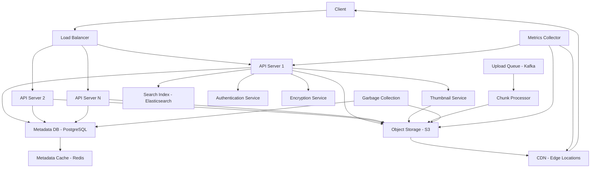

## 8. File Storage System

### Requirements
**Functional Requirements:**
- Upload files with metadata
- Download files by ID or path
- Support file versioning
- Support file sharing (public/private links)
- Support file deletion and undelete (trash)
- Support file search and filtering
- Support large files (chunked upload)
- Support resumable uploads/downloads
- Generate thumbnails/previews for media
- Support access control (permissions)

**Non-Functional Requirements:**
- High availability and fault tolerance
- Horizontal scalability to petabytes
- Low latency for file operations
- High throughput for uploads/downloads
- Durability and data integrity
- Security (encryption at rest and in transit)
- Cost efficiency
- Geographic distribution for global access

### Capacity Estimation
- Assume 10 million daily uploads
- Average file size: 1MB (mix of small and large files)
- 10% of files >100MB (large files)
- Storage per file: 1MB + 500B metadata = 1.0005MB
- Daily storage: 10M * 1.0005MB = 10 TB
- 5-year storage: 10 TB * 365 * 5 = 18.25 PB
- Peak upload rate: 1000 uploads/second
- Peak download rate: 10x upload rate = 10,000 downloads/second
- Bandwidth: 
  - Upload: 1000 * 1MB = 1 GB/s
  - Download: 10,000 * 1MB = 10 GB/s
- Metadata DB size: 10M * 500B = 5 GB/day

### APIs
```
POST /api/v1/files/upload
Headers: 
  Content-Type: multipart/form-data
  X-File-Name: "document.pdf"
  X-File-Size: 1024567
  X-Content-Type: "application/pdf"
Body: file binary
Response: {"fileId": "file_123", "version": 1, "size": 1024567, "checksum": "sha256:..."}

POST /api/v1/files/chunked-upload/start
{
  "fileName": "large_video.mp4",
  "totalSize": 2147483648,
  "chunkSize": 5242880,
  "totalChunks": 410
}
Response: {"uploadId": "upload_456", "chunkUrls": ["...", "...", ...]}

PUT {chunkUrl} (presigned URL)
Body: chunk binary

POST /api/v1/files/chunked-upload/complete
{
  "uploadId": "upload_456",
  "checksums": ["sha256:...", "sha256:...", ...]
}
Response: {"fileId": "file_789", "version": 1, ...}

GET /api/v1/files/{fileId}
Response: file binary or 302 redirect to CDN

GET /api/v1/files/{fileId}/metadata
Response: {"id": "...", "name": "...", "size": 1024, "type": "...", "createdAt": "...", "versions": [...], ...}

DELETE /api/v1/files/{fileId}
PATCH /api/v1/files/{fileId}
{
  "name": "new_name.pdf",
  "isPublic": true
}
```

### Data Model
**Files Table:**
- id (PK, VARCHAR(32))
- user_id (FK)
- name (VARCHAR(255))
- size (BIGINT)
- content_type (VARCHAR(100))
- content_hash (CHAR(64), SHA-256)
- storage_path (VARCHAR(512)) - path in object storage
- created_at
- updated_at
- is_deleted (BOOLEAN, soft delete)
- is_public (BOOLEAN)
- is_encrypted (BOOLEAN)
- encryption_key_id (FK, nullable)

**File_Versions Table:**
- id (PK)
- file_id (FK)
- version (INT)
- size (BIGINT)
- content_hash (CHAR(64))
- storage_path (VARCHAR(512))
- created_at
- created_by (FK to Users)
- is_current (BOOLEAN)

**File_Shares Table:**
- id (PK)
- file_id (FK)
- shared_by (FK to Users)
- shared_with (FK to Users, nullable for public)
- share_token (VARCHAR(64), unique) - for public links
- permissions (ENUM: 'read', 'write', 'admin')
- created_at
- expires_at (nullable)

**File_Chunks Table (for chunked uploads):**
- id (PK)
- upload_id (VARCHAR(64))
- chunk_index (INT)
- chunk_hash (CHAR(64))
- storage_path (VARCHAR(512))
- size (INT)
- uploaded_at

**File_Metadata Table:**
- id (PK)
- file_id (FK)
- key (VARCHAR(100))
- value (TEXT)
- Composite index: (file_id, key)

### High-Level Architecture
```
[Client] -> [Load Balancer] -> [API Servers] 
                          -> [Metadata DB] 
                          -> [Object Storage] 
                          -> [CDN] 
                          -> [Thumbnail Service] 
                          -> [Search Index] 
                          -> [Authentication Service]
                          -> [Encryption Service]
                          -> [Upload Queue] -> [Chunk Processor]
```

### Core Components
1. **API Servers**: Handle file operations, authentication, authorization
2. **Metadata Database**: Store file metadata, versions, shares, etc.
3. **Object Storage**: Store file content (S3-like distributed storage)
4. **CDN**: Cache frequently accessed files at edge locations
5. **Thumbnail Service**: Generate thumbnails/previews for images/videos
6. **Search Index**: Enable file search by name, content, metadata
7. **Authentication Service**: Verify user identity and permissions
8. **Encryption Service**: Handle encryption/decryption of files
9. **Upload Queue**: Manage chunked uploads and reassembly
10. **Chunk Processor**: Process and verify uploaded chunks
11. **Garbage Collection**: Clean up deleted files and old versions

### Database Choice
- **Metadata**: PostgreSQL (relational data, complex queries, JSONB for flexible metadata)
- **Object Storage**: S3-compatible distributed storage (MinIO, Ceph, or cloud S3)
- **Search**: Elasticsearch (full-text search, filtering)
- **Cache**: Redis (hot file metadata, rate limiting)
- **Why**: PostgreSQL for relationships and querying, object storage for scalability, Elasticsearch for search

### Caching Strategy
- **File Metadata**: Redis cache with TTL (1 hour)
- **Hot Files**: CDN cache with TTL (configurable per file)
- **User Permissions**: Redis cache (invalidate on change)
- **File Listings**: Redis cache for user's file list
- **Thumbnail Cache**: CDN cache for generated thumbnails
- **Upload State**: Redis cache for in-progress uploads

### Scalability
- **API Scaling**: Stateless servers behind load balancer
- **Metadata Scaling**: 
  - Partition by user_id hash
  - Read replicas for metadata queries
- **Storage Scaling**: Horizontal object storage (add nodes)
- **CDN Scaling**: Automatic edge cache expansion
- **Upload Scaling**: 
  - Parallel chunk uploads
  - Separate upload queue workers
- **Geographic Distribution**: Multi-region storage with CDN

### Reliability
- **Object Storage**: 
  - Multi-zone replication (3+ copies)
  - Erasure coding for space efficiency
  - Versioning for recovery
- **Metadata DB**: 
  - Master-slave replication with automatic failover
  - Regular backups + WAL archiving
- **CDN**: Multi-CDN strategy for redundancy
- **Upload Resilience**: 
  - Chunk checksum verification
  - Resumable uploads
  - Retry with exponential backoff
- **Backup**: 
  - Regular metadata backups
  - Cross-region replication for disaster recovery
- **Monitoring**: Upload/download latency, error rates, storage utilization, CDN hit ratio

### Bottlenecks
1. **Upload Bandwidth**: Network capacity for large file uploads
2. **Metadata DB Writes**: High write volume for file metadata
3. **Object Storage Latency**: Network transfer for file content
4. **CDN Cache Misses**: First access to files not in cache
5. **Thumbnail Generation**: CPU-intensive for large images/videos
6. **Search Indexing**: Keeping search index up-to-date with uploads

### Failure Cases
1. **Object Storage Unavailable**: 
   - Queue uploads for retry
   - Serve from cache for reads (if available)
   - Return error for new uploads
2. **Metadata DB Downtime**: 
   - Cache recent metadata in Redis
   - Queue metadata writes
   - Degrade to read-only mode
3. **CDN Failure**: 
   - Fallback to origin storage
   - Increased latency for cache misses
4. **Upload Failure**: 
   - Resumable uploads allow continuation
   - Chunk-level retries
   - Clean up partial uploads
5. **Network Partition**: 
   - Local queuing with eventual consistency
   - Prioritize read operations

### Trade-offs
1. **Storage Cost vs. Performance**: 
   - Hot storage (SSD): Fast, expensive
   - Warm storage (HDD): Slower, cheaper
   - Cold storage (Archive): Very slow, very cheap
2. **Consistency vs. Availability**: 
   - Strong consistency: Immediate visibility of uploads
   - Eventual consistency: Better availability, temporary staleness
3. **Encryption vs. Performance**: 
   - Client-side encryption: More secure, higher client CPU
   - Server-side encryption: Easier, higher server CPU
4. **Versioning vs. Storage**: 
   - Full versioning: Higher storage, better recovery
   - Limited versioning: Lower storage, less flexibility
5. **CDN vs. Origin**: 
   - Aggressive CDN caching: Lower latency, higher cost
   - Origin-only: Higher latency, lower cost

### Architecture Diagram


### Interview Follow-up Questions
1. How would you handle files larger than 5GB efficiently?
2. What strategies would you use to prevent abuse (storage limits, rate limiting)?
3. How would you implement file deduplication (same content, different users)?
4. How do you handle file encryption while maintaining searchability?
5. What's your approach to handling copyright infringement (DMCA takedowns)?
6. How would you implement file preview generation for different file types?
7. How do you handle concurrent writes to the same file (collaborative editing)?
8. What metrics would you monitor to detect storage service degradation?
9. How would you implement cross-region file synchronization for global users?
10. How would you handle file retention policies (auto-delete after X days)?